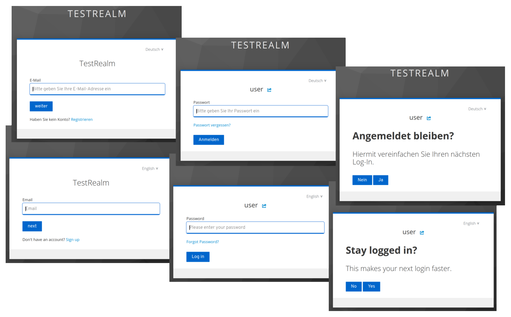
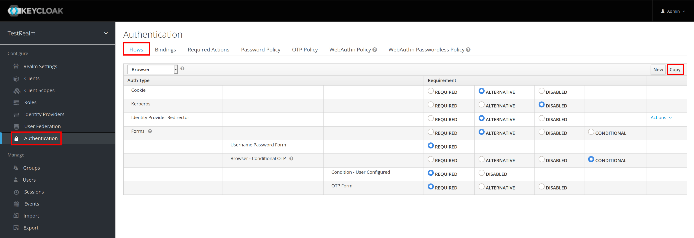
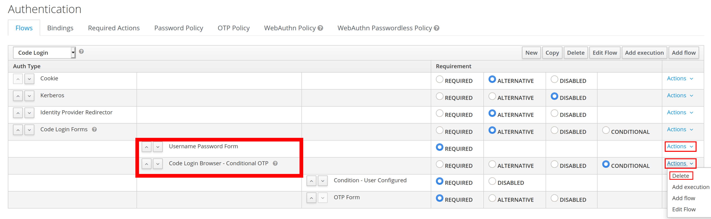
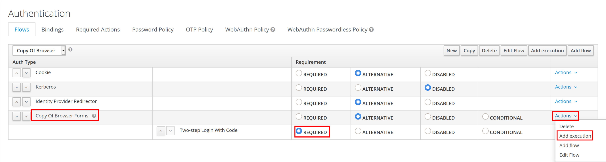
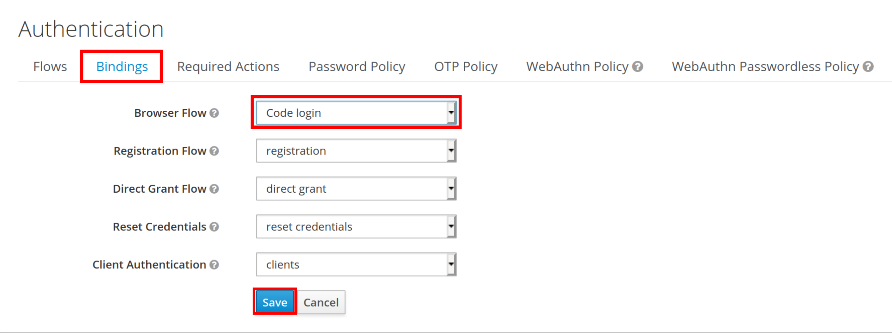
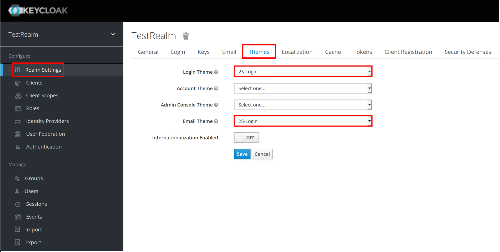
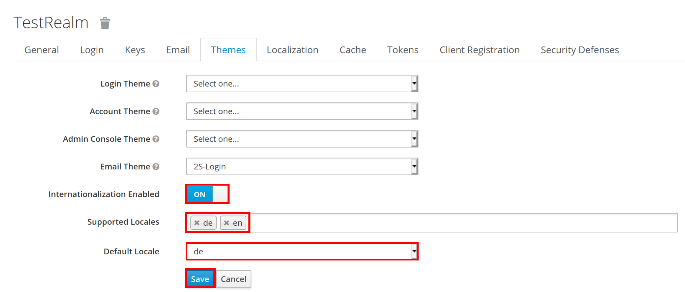

# What is keycloak-split-login-forms?

It is an alternative authentication flow, seperating the input fields for email and password.
    

## Keycloak support

Developed and tested in Keycloak version 12.0.4.

## How to configure in Keycloak

 1. Once  `keycloak-split-login-forms` is deployed on your server, (re-)start said server.
 
    You can use `./restart.sh` in the root directory of the project.
 
 2. Now open the web admin console of keycloak, under Configure go to `Authentication`. In the `Flows` tab create a copy of the `Browser` flow.
   
   
 3. Delete `Username Password Form` and `Browser - Conditional OTP` in your new flows Forms.
   
   
 4. Add a new execution to `*your flow name* Forms` using the `two-step-login-with-code` provider and set its requirement to `REQUIRED`.
    -replace
   
 5. Switch to the `Bindings` tab and change your Browser Flow to your new flow and save the settings.
    -replace
   
 6. Now open the `Realm Settings`, go to the `Themes` tab and select the `Split-login form` for the Login- aswell as the Email Theme.
    -replace

 7. Enable `Internationalization` and remove all the `Supported Locales` except `de` and `en` (and any languages you added) and set the `Default Locale` to your preference and save.
    -replace
  